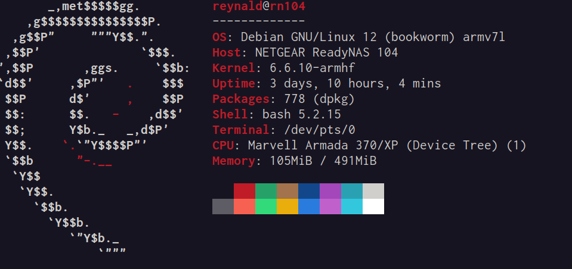

# Custom kernel for Netgear ReadyNas 104 (rn104) Nas on Debian 12

&#9888; __DO WITH YOUR OWN RISK! I'M NOT RESPONSIBLE FOR WHAT HAPPENS TO YOUR DEVICE __ &#9888;  

This repo contains my effort to maintain this device on the last Debian releases.   

Custom kernel is from kernel.org. It was build and tested on real hardware.  

Works :  
* Front LCD Display (use /usr/local/bin/display.sh)
* RAID 0/1/5 (Raid 5 is pretty slow, but it works)    
* Front LED ( use iostat)  
* Everything :)  

 

## How to install Debian GNU/Linux 12?
First, you need to install vanilla version of Debian:  

* This guy wrote a tutorial for installing release 10 of Debian on our device. Simply replace any instance for "buster" to last release of Debian.
https://www.katerkamp.de/howto/osinstall/rn104-d-i.xhtml  


## After install   
We will need to install some software:  
````  
su -  
apt update && apt upgrade  
apt install macchanger iostat fancontrol hdparm git  
exit  
````
Clone this repository on your nas:  
````  
cd /home/$USER  
git clone https://github.com/keystone-sideral/netgear_rn104  
````  
Read README.txt for instructions:    
````  
cd netgear_rn104
less README.txt  
````   
